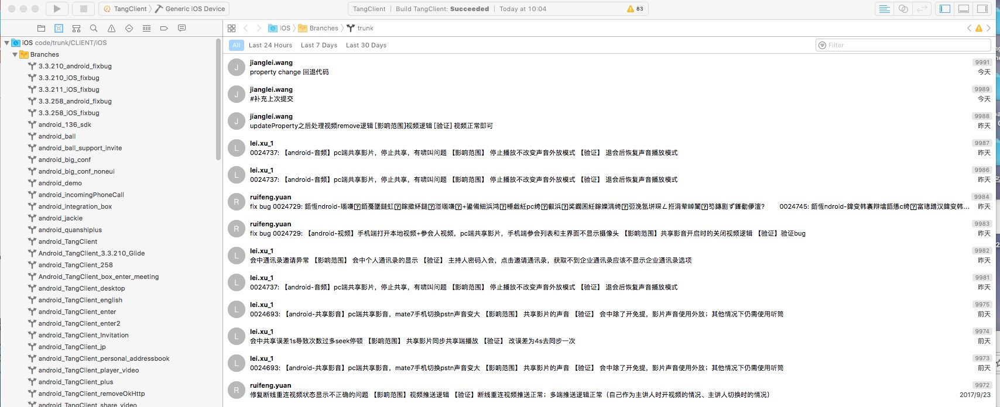
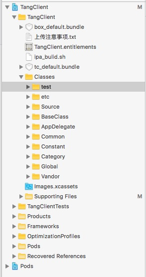
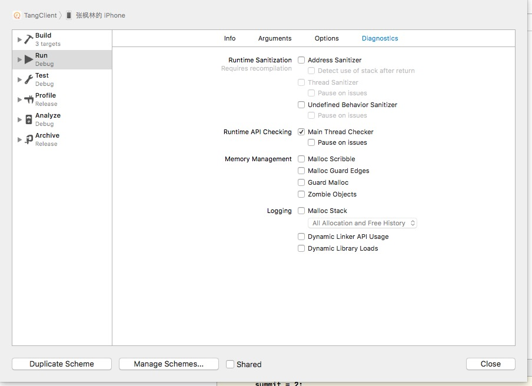
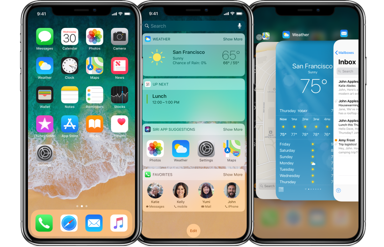
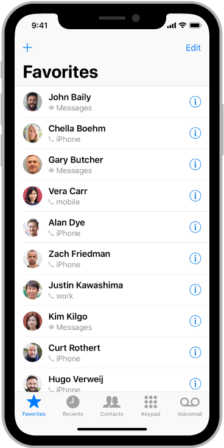
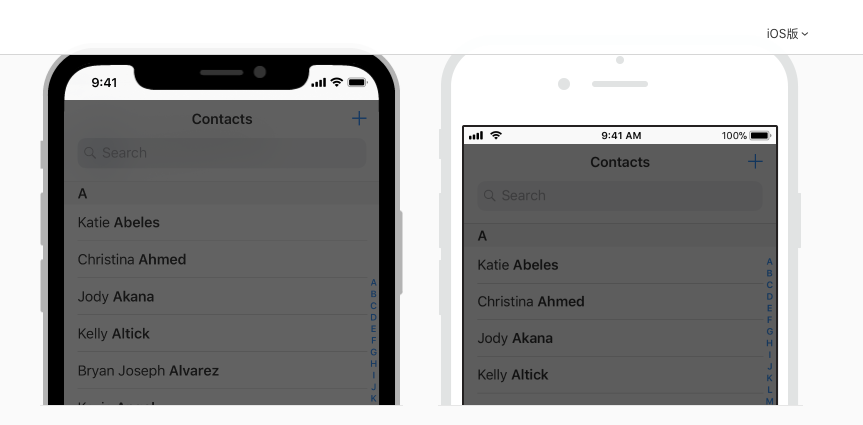
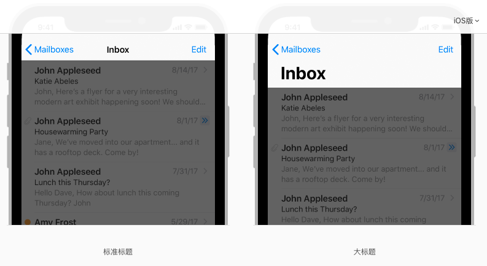
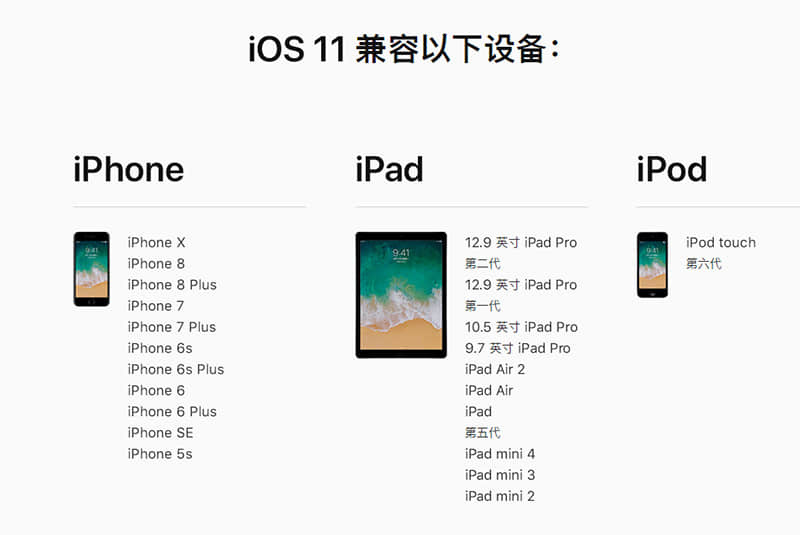
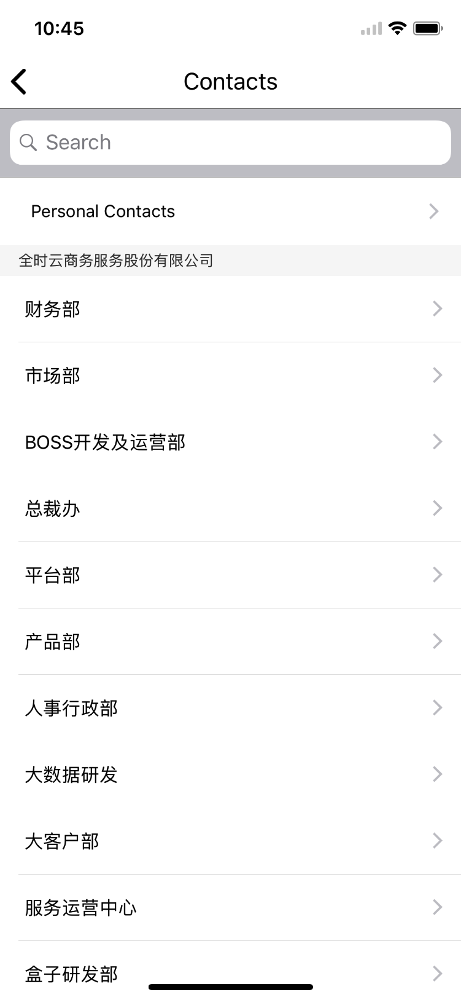

# IOS11

# 一、xcode9
### 1、iOS 11 无线调试

1. To open the Devices and Simulators window, choose Window > Devices and Simulators
2. xcode 连接 iOS11手机
3. 保证mac与手机在同一个局域网下，在弹出的界面中，勾选connect via network
4. 拔掉数据线即可

### 2、在Xcode 9 中，引入了 GitHub 新源代码管理导航器 可以展示 branch 分支和 tag 标签。支持Github等登录

>  双击对应 commit
> 可以直接查看本次提交

### 3、 cmd +/- 可以用来调整编辑器的字体大小了

用处：分享代码的很有用

### 4、 Folder和Group的同步性
 >之前,我们在XCode中,更改Folder的名字,在FInder中工程对应的文件夹的名字并不会同步的改变,这会造成我们重命名文件夹变得非常不方便,往往要先在XCode中移除,然后在Finder中重命名,再添加回Xcode。现在 在Xcode9中重名命Folder,Finder中的也同步的改变了

### 5、runtime问题检测

在xcode8中,已经包含了Address Scanitizer和Thread Scanitizer,在Xcode9中,又新增了 Undefiner Behavior Scanitizer,它可以实时的检测一系列的问题.不过我们更能明显感受到的是Main Thread Checker,它可以在运行时确保你没有把UI更新 代码写在了非主线程中

----
----

# 二、iPhoneX介绍
[iPhoneX](https://developer.apple.com/iphone/)

> iPhone X 包括一个大型，高分辨率，圆形的边缘到边缘的显示器，提供了一个沉浸式，内容丰富的体验
    
    

- **屏幕尺寸**
  >在纵向方向上，iPhone X上的显示屏的宽度与iPhone 6，iPhone 7和iPhone 8的4.7“显示屏的宽度相匹配。然而，iPhone X上的显示器比4.7”显示器高145个，导致大约20％的内容垂直空间。
  
  
  
  
  **为您的应用程序中的所有图稿提供高分辨率图像。iPhone X具有比例因子为@3x的高分辨率显示**
  
- **布局** 在设计iPhone X时，您必须确保布局填满屏幕，并且不会被设备的圆角，传感器外壳或用于访问主屏幕的指示灯遮蔽。
 
 
 
 
 	
 >1、**注意状态栏的高度**。状态栏在iPhone X上比在其他iPhone上更高。如果您的应用假定固定状态栏的高度用于将内容定位在状态栏的下方，则必须更新您的应用，才能根据用户的设备动态定位内容。**请注意，当背景任务（如录音和位置跟踪）处于活动状态时，iPhone X上的状态栏不会改变高度**。
 >2、**插入必要内容以防止剪辑**。一般来说，内容应该是居中对称的，所以它在任何方向看起来都很棒，不会被角落或设备的传感器外壳夹住，或被访问主屏幕的指示器遮挡。为获得最佳效果，请使用标准的系统提供的界面元素和自动布局构建您的界面。所有应用程序都应遵循UIKit定义的安全区域和布局边距，这些区域可以根据设备和上下文进行适当的填充。安全区域还可以防止内容覆盖状态栏，导航栏，工具栏和标签栏。
 
- **颜色**

 > iPhone X上的显示器支持P3色彩空间，可以产生比sRGB更丰富，更饱和的颜色。
 
- **手势**
 > iPhone X上的显示屏使用屏幕边缘手势来访问主屏幕，应用程序切换器，通知中心和控制中心。

 > 避免干扰系统范围的屏幕边缘手势。人们依靠这些手势在每个应用程序中工作。在极少数情况下，像游戏这样的沉浸式应用程序可能需要自定义的屏幕边缘手势，优先于系统的手势 - 第一个滑动会调用特定于应用的手势，而第二次滑动则会调用系统手势。这种行为（称为边缘保护）应该谨慎实施，因为它使得用户难以访问系统级的操作。 
 
- **附加设计注意事项**。
  
  >参考认证方法准确。 iPhone X支持Face ID进行身份验证。如果您的应用程序与Apple Pay或其他系统身份验证功能集成，请勿在iPhone X上引用Touch ID。同样，请确保您的应用程序在支持Touch ID的设备上未引用Face ID。请参阅验证。

 >不要重复系统提供的键盘功能。在iPhone X上，即使使用自定义键盘，Emoji / Globe按钮和Dictation按钮也自动显示在键盘的下方。您的应用程序不能影响这些按钮，因此避免在键盘中重复这些按钮造成混乱。请参阅自定义键盘。

 

- **状态栏** 状态栏出现在屏幕的上边缘，并显示有关设备当前状态的有用信息，如时间，蜂窝电话，网络状态和电池电量。状态栏中显示的实际信息因设备和系统配置而异. iPhone X的状态栏高度是高于之前所有的iPhone版本的
	

----
----

# 三、iOS 11中的新功能

- [增强现实。ARKit](https://developer.apple.com/ios/human-interface-guidelines/technologies/augmented-reality/)
  > 随着增强的现实，应用程序可以提供身临其境的，引人入胜的体验，将现实的虚拟对象与现实世界无缝融合。

- [更大的导航。](https://developer.apple.com/ios/human-interface-guidelines/bars/navigation-bars/)
  > 为了在浏览和搜索时提高清晰度和上下文，应用程序可以实现导航栏，包括大型，大胆的标题。

  

- **更清晰的图标。**
  > 填充形状和较厚的笔触重量保持图标最小，同时改善对比度。请参阅自定义图标和系统图标。

- [拖放。](https://developer.apple.com/ios/human-interface-guidelines/user-interaction/drag-and-drop/)
  > 拖放功能可让用户使用单个手指将所选的照片，文字和其他内容从一个位置移动到另一个位置，甚至在iPad上的应用之间移动。

- [面部ID和触摸ID FaceID TouchID](https://developer.apple.com/ios/human-interface-guidelines/user-interaction/authentication/#face-id-and-touch-id)
  > 您的应用程序可以与系统的生物识别安全功能集成，提供人们信任的安全，熟悉的身份验证。

- [近场通讯 NFC。](https://developer.apple.com/ios/human-interface-guidelines/user-interaction/near-field-communication/)
  > 在支持的设备上运行的应用程序可以从附加到现实世界对象的电子标签中无线读取数据。

- [安全区布局指南](https://developer.apple.com/ios/human-interface-guidelines/visual-design/adaptivity-and-layout/#layout-guides-and-safe-area)
  > 遵守系统的安全区域，确保在布局中适当地插入内容，并防止内容覆盖状态栏，导航栏，工具栏和选项卡栏。布局指南定义了实际上不显示屏幕的矩形区域，但有助于内容的定位，对齐和间距。该系统包括预定义的布局指南，可以轻松地在内容上应用标准边距，并限制文本的宽度以获得最佳的可读性。您还可以定义自定义布局指南。
  
  
  **坚持UIKit定义的安全区域和布局边距。** 
  这些布局指南基于设备和上下文确保适当的内插。安全区域还可以防止内容覆盖状态栏，导航栏，工具栏和标签栏。标准系统提供的视图会自动采用安全区域布局指南。

- [印刷变更](https://developer.apple.com/ios/human-interface-guidelines/visual-design/typography/)
  > 增加的文字大小和重量有助于整个系统的可读性。该系统还提供一系列更大型号的尺寸，除了标准的动态尺寸，适用于具有辅助功能需求的用户。

	

- iOS11开发新特性之停止支持32位APP
iOS11 放弃支持 iPhone5、iPhone5c、iPad4 ，标志着在硬件层面，32位设备退出了历史舞台，iOS 系统不再兼容32位设备。 
	
同时 iOS11 也将不再支持 32位 APP 运行, 32位 APP 在 APPStore 无法被搜到，已经下载的 APP 无法在“已购”项目中安装。
	
iOS 11 只兼容 64-bit 设备，也就是搭载 A7 以上处理器的设备. 下面是 iOS 11 兼容设备的全部设备：
    
    

[iOS11开发新特性之停止支持32位APP](http://blog.sunnyxx.com/2014/12/20/64-bit-tips/)

----
----

# 四、“云会议APP” 在iOS 11出现的问题

   详见图片
----

	
	
# 五、APP 适配 iOS 11 && iPhone X

- 发现某些界面tableView的sectionHeader、sectionFooter高度与设置不符的问题.
 
 
  
  在iOS11中如果不实现
		
		 -tableView: viewForHeaderInSection:
		 -tableView: viewForFooterInSection: 
  则
  	   
  	   	-tableView: heightForHeaderInSection:
  	   	-tableView: heightForFooterInSection:
  
  不会被调用，导致它们都变成了默认高度。
  这是因为tableView在iOS11默认使用Self-Sizing，tableView的estimatedRowHeight、estimatedSectionHeaderHeight、 estimatedSectionFooterHeight三个高度估算属性由默认的0变成了UITableViewAutomaticDimension。 解决办法简单粗暴，就是实现对应方法或把这三个属性设为0。
  
  
- 如果你使用了Masonry，那么你需要适配safeArea
  
 
  
		- (void)viewDidAppear:(BOOL)animated{
    		[self setUpContraint]; // v
		}
		
		if (@available(iOS 11.0, *)) {
    		make.edges.equalTo(self.view).insets(self.view.safeAreaInsets)
		} else {
    		make.edges.equalTo(self.view)
		}
		
    

- UISearchBar	的 UISearchBarBackground 高度默认变成 56。如果自定义的SearchBar的高度小于56 ，会出现SerachBar部分被遮挡。
 
 
  	
		CGFloat searchBarHeight = 44.0;
    	if (@available(iOS 11.0, *)){
        	searchBarHeight = 56.0;
    	}
    	
- 导航栏高度的变化
  >iOS11之前导航栏默认高度为64pt(这里高度指statusBar + NavigationBar)，iOS11之后如果设置了prefersLargeTitles = YES则为96pt，默认情况下还是64pt，但在iPhoneX上由于刘海的出现statusBar由以前的20pt变成了44pt，所以iPhoneX上高度变为88pt，如果项目里隐藏了导航栏加了自定义按钮之类的，这里需要注意适配一下。

    	
- iOS 11下APP中tableView内容下移20pt或下移64pt的原因分析
	
  >原因是iOS 11中Controller的automaticallyAdjustsScrollViewInsets属性被废弃了，所以当tableView超出安全区域时系统自动调整了SafeAreaInsets值，进而影响adjustedContentInset值，在iOS 11中决定tableView的内容与边缘距离的是adjustedContentInset属性，而不是contentInset。adjustedContentInset的计算方式见本文第二部分内容。因为系统对adjustedContentInset值进行了调整，所以导致tableView的内容到边缘的距离发生了变化，导致tableView下移了20pt（statusbar高度）或64pt（navigationbar高度）。
 
  **在我们项目中目前 没有出现，我们使用的是Manory 布局**
  
- LaunchImage

  > 关于iPhoneX(我就不吐槽刘海了...)，如果你的APP在iPhoneX上运行发现没有充满屏幕，上下有黑色区域，那么你应该也像我一样LaunchImage没有用storyboard而是用的Assets.
  
  **在我们项目中目前 没有出现**

- TabBarController

   > 因为我们的项目用了第三方的TabBarController，在iPhoneX运行，tabBar看起来怪怪的...估计作者要等到猴年马月才适配iPhoneX，项目又着急上线，就自己修改了第三方，主要是tabBar高度及tabBarItem偏移适配，iPhoneX由于底部安全区的原因UITabBar高度由49pt变成了83pt，
   
   **在我们项目中目前 没有出现**

----
----
##### 参考文章
- [XCode9的新变化](http://www.cocoachina.com/ios/20170922/20626.html)
- [为你的应用兼容iPhone X](http://www.cocoachina.com/ios/20170920/20608.html)
- [iOS 11，iPhone X 适配问题](https://github.com/2877025939/iOS11)
- [Human Interface Guidelines - Apple](https://developer.apple.com/ios/human-interface-guidelines/overview/iphone-x/)